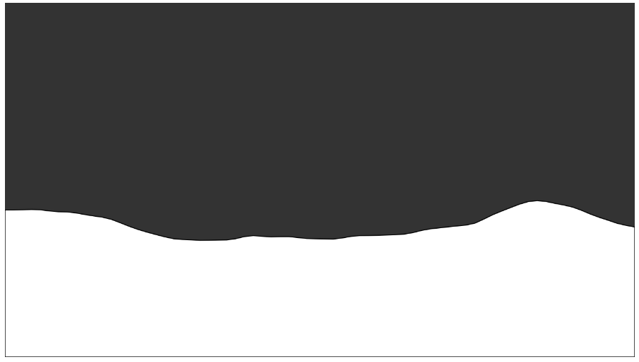

# Quiz 8

## Imaging Technique Inspiration

I find water waves exciting to animate considering the assignment features several areas that can be used with ripple patterns. This could be used it on the background, foreground or on a shape. The **kinetic energy** and **randomness** makes the artwork more *dynamic* which I imagine is similar to the *reimagined Vincent Van Gogh's Starry Night App*. For the inspiration I have two works under here to show the imaging technique which I'm looking for which is the *impressionist water style* that uses *strokes* and *ripple effect*:
| Artwork 1  | Artwork 2 |
| ------------- |:-------------:|
|      |     |
| Vincent Van Gogh's Starry Night      | Claude Monet's Water Lillies    |

## Coding Technique Exploration
To replicate this imaging technique I found two coding examples called **Noise Wave** and **Flocking**. On the table below I listed how I will be using the technique:
| Noise Wave    | Flocking     |
| ------------- |:-------------:|
|     | |
| [P5.js Link to Noise Wave](https://p5js.org/examples/math-noise-wave.html)    | [P5.js Link to Flocking](https://p5js.org/examples/simulate-flocking.html)    |
| The **noise wave** will help with creating the ripple effect on top of the water. This will help with conveying the feeling of water. By layering different waves on top of each other, this will can help replicate a pond or sea. Additionally, we can incoporate music into the waves where music would make the waves ripple   | **Flocking** can help with showing the brush strokes on top of the water. By creating a multiple brush stropes we can replicate the brush srokes of the impressionist artworks  |
By using both techniques together we can create impressionist version of water as code.